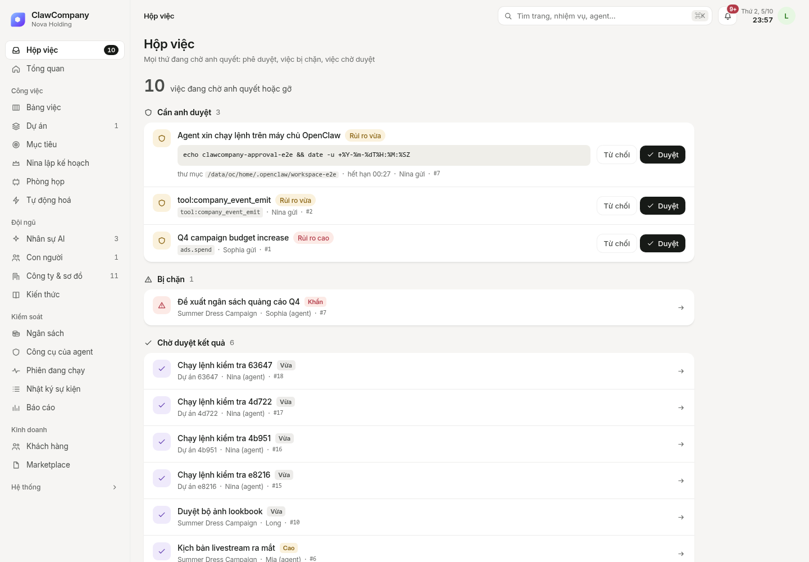
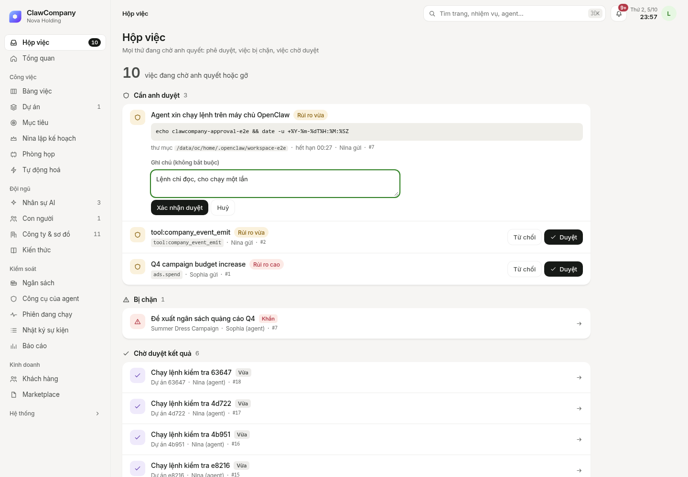
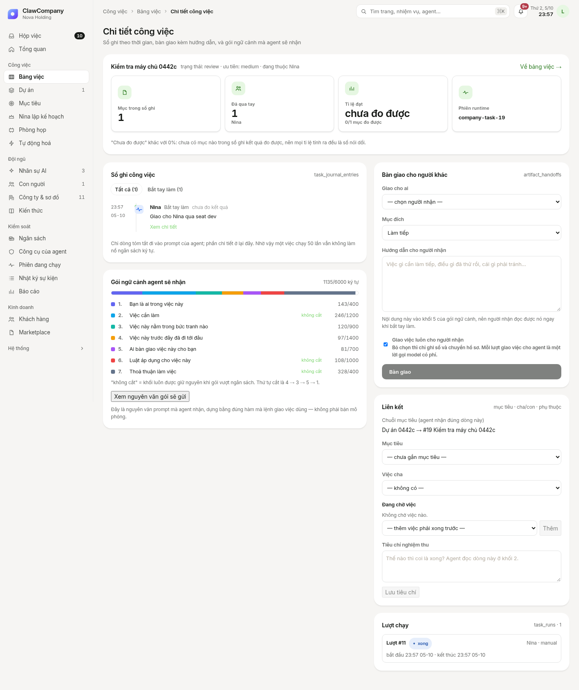

# D1.1 — Duyệt lệnh exec end-to-end với gateway OpenClaw thật

**Kết luận:** Bấm *Duyệt*/*Từ chối* trong Hộp việc giờ thực sự quyết định lệnh trên gateway. Đã kiểm trên OpenClaw 2026.9.8 chạy thật (exec, sổ duyệt, chạy lệnh đều thật); chỉ model là giả có kịch bản (`tools/scripted_llm.py`) để agent chắc chắn xin chạy đúng một lệnh.

## Trước khi sửa (đo trên gateway thật)
| Lượt | Kết nối | Kết quả |
|---|---|---|
| 1–2 | không `caps`, không `operator.admin` / chỉ `caps:["exec-approvals"]` | Gateway từ chối ngay: `exec denied: Headless runs cannot wait for interactive exec approval.` Không có hàng duyệt nào. |
| 3 | `caps` + `operator.admin` | Có hàng duyệt nhưng tiêu đề là `OpenClaw agent requests: action` (không thấy lệnh). Bấm Duyệt chỉ đổi trạng thái cục bộ, **không gửi gì tới gateway** → lệnh treo tới hết hạn. Follower không dừng vì không nhận trạng thái `final`. |

Nguyên nhân (từ mã OpenClaw): `canDeliverApprovals` cần `operator.approvals` **và** `caps` chứa `exec-approvals`; `isApprovalRecordVisibleToClient` chỉ cho client không ghép cặp thiết bị thấy bản ghi khi có `operator.admin`.

## Đã sửa
- `openclaw_native`: khai `caps:["exec-approvals"]` khi bật `OPENCLAW_REQUEST_APPROVALS_SCOPE`; tap frame tùy chọn `OPENCLAW_FRAME_LOG`.
- `runtime_stream.record_approval`: đọc `request.command/cwd/host`, tiêu đề `Chạy lệnh: …`, mức rủi ro theo `commandAnalysis.riskKinds`; nhận `exec.approval.resolved`; không tạo hàng trùng; ghi audit `approval.requested` / `approval.resolved`. Thêm `final` vào trạng thái kết thúc (→ task `review`).
- `approval_bridge.decide`: ghi quyết định + audit `approval.decided` **trước** khi gọi `exec.approval.resolve` (gateway gửi `resolved` về trước cả phản hồi RPC); không gửi được → audit `approval.relay_failed` và ghi chú "recorded locally only".
- `POST /api/approvals/{id}/resolve`: hàng `openclaw:` đi qua bridge (approved→`allow-once`, rejected→`deny`; 409 nếu đã quyết).
- Hộp việc: thẻ hiện "Agent xin chạy lệnh trên máy chủ OpenClaw", khối lệnh, thư mục, giờ hết hạn; báo rõ khi quyết định chưa tới được OpenClaw.
- `upstream_readiness().card_delivery`: cho biết thiếu scope nào.

## Sau khi sửa (gateway thật, có `operator.admin`)
**Duyệt (task 16) — 9/9 bước OK.** Frame hai chiều (rút gọn từ `evidence/d11/frames_after2.jsonl`):
```
in  exec.approval.requested {id:"3640ba46…", request:{command:"echo clawcompany-approval-e2e && date -u +%Y-%m-%dT%H:%M:%SZ", cwd:".../workspace-e2e", host:"gateway", allowedDecisions:["allow-once","allow-always","deny"], sessionKey:"agent:dev:company-task-16"}}
out exec.approval.resolve   {id:"3640ba46…", decision:"allow-once"}
in  exec.approval.resolved  {id:"3640ba46…", decision:"allow-once", resolvedBy:"clawcompany"}
```
toolResult thật: `clawcompany-approval-e2e\n2026-10-05T23:49:19Z` (isError=false) → task sang `review` sau 2,4 s, run `completed`. Audit đúng thứ tự: `approval.requested → approval.decided → approval.resolved`.

**Từ chối (task 17) — 9/9 OK.** toolResult `Exec denied (gateway id=…, user-denied)`, lệnh không chạy, hàng `denied`, đủ 3 mốc audit.

**Qua giao diện thật (task 19, Playwright):** thẻ hiện đúng lệnh → bấm Duyệt → Xác nhận → thẻ biến mất → task `review`, kết quả lệnh có trong transcript, 3 mốc audit, 0 lỗi console.





**Thiếu admin sau sửa (task 18):** gateway vẫn từ chối `Headless runs cannot wait…` → không có thẻ. Đây là giới hạn phía OpenClaw, không phải lỗi của ClawCompany.

## Kiểm thử
- `tests/test_d11_approval_e2e.py` — 9 test phát lại frame thật. Mutation: bỏ định tuyến Hộp việc → 2 fail; bỏ `final` → 1 fail; bỏ nhận diện `allow-once`/family `resolved` → 1 fail.
- Toàn bộ: **814 passed, 2 skipped**.
- Tái lập: `ADMIN=true tools/devup_approval.sh <framelog>` rồi `tools/e2e_approval.py` hoặc `tools/ui_approval_e2e.py`.

## Giới hạn còn lại
1. **Cần `operator.admin`** (hoặc ghép cặp thiết bị) để gateway giao thẻ duyệt cho backend. Bật `OPENCLAW_REQUEST_ADMIN_SCOPE=true` là cấp quyền rộng cho kết nối backend → cần chủ sở hữu quyết định. Không bật thì agent bị từ chối mọi lệnh cần hỏi.
2. **Hủy lượt chạy** (`chat.abort`) trả `unauthorized` với kết nối hiện tại — chưa xử lý.
3. Chỉ dùng `allow-once`; `allow-always` và `exec.approval.grants.revoke` (có trên gateway) chưa nối vào UI.
4. Model giả có kịch bản; chưa thử với model thật.
5. **Follower phải gắn vào phiên trước khi agent xin chạy lệnh.** Đo ở D1.2 (task 24, follow trễ 8 giây): gateway từ chối ngay `exec denied: Headless runs cannot wait for interactive exec approval` vì lúc đó không có client duyệt nào kết nối. Xem `cost-reconciliation.md`.
